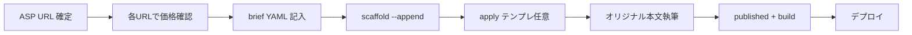

# アフィリエイト記事 自動作成ワークフロー

**入力:** 記事テーマ + **確定した ASP / 商品 URL**  
**出力:** `data/affiliate-briefs/{slug}.yaml` ＋ `data/guide_articles.csv` の1行（`--append` 時）

> ルールの正本: [affiliate-article-rules.md](./affiliate-article-rules.md)

---

## フロー概要



| 段階 | 担当 | 成果物 |
|------|------|--------|
| 0. URL 確定 | 人 | Amazon / A8 / afb の実リンク |
| 1. テーマ確定 | 人 | テーマキー or ブリーフ YAML |
| 2. 価格確認 | 人 / AI | 各商品 URL を開き最新価格を brief に反映 |
| 3. 雛形生成 | CLI | CSV 行（draft）+ ブリーフ（**本文は未完成の雛形**） |
| 3b. テンプレ反映 | CLI（任意） | `apply_affiliate_article_template.py` — **CSV 行が既にあること**が前提 |
| 4. 本文完成 | AI / 人 | **記事ごとのオリジナル** `section_*`（テンプレ置換のみ不可） |
| 5. 公開 | 人 | `content_status=published` |
| 6. 検証・デプロイ | CLI | `validate_csv.py` → `build_*` → push |

**URL 未確定の段階では `--append` しない。** ブリーフだけ置いて待つ。

---

## 方法A: ブリーフ YAML から（推奨）

```bash
cp docs/affiliate/theme-brief.template.yaml \
   data/affiliate-briefs/affiliate-textbooks-recommend.yaml

# エディタで products.*_url / related_links に実 URL を記入

python3 tools/scaffold_affiliate_article.py \
  --from-brief data/affiliate-briefs/affiliate-textbooks-recommend.yaml \
  --append
```

必須: `slug`, `search_intent`, **ASP / 商品 URL**  
任意: `title`, `layout`, `products`, `asp_primary`, `related_links`

---

## 方法B: 定義済みテーマ

```bash
python3 tools/scaffold_affiliate_article.py --list-themes

# テーマからブリーフを生成（CSV 追記は URL 記入後）
python3 tools/scaffold_affiliate_article.py \
  --theme textbooks-recommend \
  --slug affiliate-textbooks-recommend \
  --write-brief

# brief に URL を入れてから
python3 tools/scaffold_affiliate_article.py \
  --from-brief data/affiliate-briefs/affiliate-textbooks-recommend.yaml \
  --append
```

`--theme ... --append` だけでは **URL 未設定ならエラー** になる。

---

## 方法C: カスタム1行

```bash
python3 tools/scaffold_affiliate_article.py \
  --theme custom \
  --slug affiliate-special-topic \
  --title "◯◯試験の〇〇おすすめ比較" \
  --search-intent "〇〇を比較して選びたい" \
  --asp amazon \
  --write-brief

# brief に URL 記入後 --from-brief --append
```

---

## レイアウト種別

| layout | 説明 | 本文 |
|--------|------|------|
| `csv` | 通常の試験ガイドと同じ | `section_*` のみ |
| `product-comparison` | 比較表・商品カード（書籍・講座） | CSV + brief の `products` |

`product-comparison` は **exam-site-shell のビルドで自動挿入**（`affiliate_product_ui.py`）。  
brief に `comparison_kind: books | courses` と ASP URL を記載する。

**自動 UI（名称リンク）**

| 位置 | 仕様 |
|------|------|
| 比較表・商品名/講座名列 | ASP 黒テキストリンク（`.affiliate-compare-name-link`） |
| 要点・右下表紙下 | 1位名称ラベル（**黒下線・最大2行**、`.seo-key-points-aside-label`） |
| 要点リスト内 | 本文と同様「」+ 青リンク（`affiliate_body_links.py`） |

### offer_type 早見表

| 対象 | `comparison_kind` | 必須 URL フィールド |
|------|-------------------|---------------------|
| テキスト・問題集 | `books` | `amazon_url`（問題集は `workbook_amazon_url`） |
| オンライン講座等 | `courses` | `a8_url` / `affiliate_url` / `afb_url` のいずれか |

完成テンプレ:

```bash
python3 tools/apply_affiliate_article_template.py --template affiliate-textbooks-recommend
python3 tools/apply_affiliate_article_template.py --template affiliate-online-course-compare
```

---

## AI（Cursor）への依頼テンプレ

```text
【タスク】アフィリエイト記事の本文を完成させる

【正本】
- docs/affiliate/affiliate-article-rules.md
- docs/seo-article-guidelines.md（アフィリエイト節）
- data/affiliate-briefs/{slug}.yaml

【前提】
ASP / 商品 URL は brief に確定済み。未確定なら CSV 行を作らない。

【必須 — 執筆原則（最優先）】
1. 各 products の ASP / 公式 URL を開き、最新価格・版・料金体系を確認して brief と本文に反映する（推測・転記禁止）
2. テンプレ・他記事の流用禁止。当該 slug のタイトル・検索意図・商品に沿って section ごとにオリジナル執筆する
3. 複数 slug を一括で機械生成しない。1記事ずつ完成させる

【必須 — 形式・法務】
1. tags に「アフィリエイト」
2. section_*_body を 180〜300 文字・公式確認トーン（中身は商品固有）
3. related_links は既存 slug 2件以上 + ASP URL
4. original_note に ASP・商品 ID・報酬メモ（非公開）
5. 【PR・広告】等の定型表記を入れない
6. 運用者向け文言を公開本文に入れない
7. brief の comparison_kind（books / courses）と products の URL フィールドを記事種別に合わせる
8. 価格確認後 fact_checked_at を更新

【公開時】
content_status=published → validate_csv.py → build_article_pages.py
```

---

## テーマキー一覧（`--theme`）

| theme | 検索意図 | 既定 slug | ASP |
|-------|----------|-----------|-----|
| `textbooks-recommend` | おすすめテキスト比較 | `affiliate-textbooks-recommend` | amazon |
| `problem-books` | 問題集おすすめ | `affiliate-problem-books` | amazon |
| `online-course-compare` | オンライン講座比較 | `affiliate-online-course-compare` | a8 |
| `correspondence-course` | 通信講座 | `affiliate-correspondence-course` | a8 |
| `cram-school` | 予備校・塾 | `affiliate-cram-school` | a8 |
| `mock-exam-materials` | 模試・直前教材 | `affiliate-mock-exam-materials` | amazon+a8 |
| `free-vs-paid-study` | 無料 vs 有料 | `affiliate-free-vs-paid-study` | internal |
| `beginner-material-set` | 初心者セット | `affiliate-beginner-material-set` | amazon+a8 |
| `retake-short-course` | 再受験短期 | `affiliate-retake-short-course` | a8 |
| `qualification-support-service` | 申込支援 | `affiliate-qualification-support-service` | a8 |
| `custom` | 任意 | 要 `--slug` | 要 `--asp` |

---

## 公開前（必ず）

```bash
python3 tools/validate_csv.py
python3 tools/build_article_pages.py
# 対象 slug の index.html が articles/ に生成されていることを確認
```

[affiliate-article-rules.md](./affiliate-article-rules.md) §11 チェックリストをすべて確認する。

---

*最終更新: 2026-06-03（価格 URL 確認・オリジナル執筆の必須原則を追加）*
