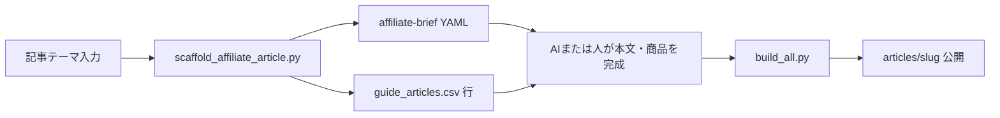

# アフィリエイト記事 自動作成ワークフロー

**入力:** 記事テーマ（定義済み `--theme` または `theme-brief.template.yaml` のコピー）  
**出力:** `data/affiliate-briefs/{slug}.yaml` ＋ `data/guide_articles.csv` の1行（`--append` 時）

---

## フロー概要



| 段階 | 担当 | 成果物 |
|------|------|--------|
| 1. テーマ確定 | 人 | テーマキー or ブリーフ YAML |
| 2. 雛形生成 | CLI | CSV行（draft）+ ブリーフ |
| 3. 本文完成 | AI / 人 | `section_*` 本文、商品リスト、ASP URL |
| 4. 比較UI（任意） | 人 / 開発 | `tools/articles_{slug}.py` + CSS |
| 5. 検証・公開 | CLI | `build_all.py` 成功 |

---

## 方法A: 定義済みテーマ（最短）

```bash
python3 tools/scaffold_affiliate_article.py --list-themes
python3 tools/scaffold_affiliate_article.py \
  --theme textbooks-recommend \
  --slug affiliate-textbooks-recommend \
  --append
```

続けて Cursor に依頼する例:

```text
data/affiliate-briefs/affiliate-textbooks-recommend.yaml と
docs/affiliate/affiliate-article-rules.md に従い、
guide_articles.csv の affiliate-textbooks-recommend 行の
section_* 本文を完成させて。商品はブリーフの products を参照。
```

---

## 方法B: ブリーフ YAML から生成

```bash
cp docs/affiliate/theme-brief.template.yaml data/affiliate-briefs/affiliate-my-topic.yaml
# エディタで theme / search_intent / products 等を記入

python3 tools/scaffold_affiliate_article.py \
  --from-brief data/affiliate-briefs/affiliate-my-topic.yaml \
  --append
```

必須フィールド: `slug`, `theme`（または `theme_key`）, `search_intent`  
任意: `title`, `layout`, `products`, `asp_primary`, `related_links`

---

## 方法C: カスタム1行（テーマ未登録）

```bash
python3 tools/scaffold_affiliate_article.py \
  --theme custom \
  --slug affiliate-special-topic \
  --title "◯◯試験の〇〇おすすめ比較" \
  --search-intent "〇〇を比較して選びたい" \
  --asp amazon \
  --layout csv \
  --append
```

---

## レイアウト種別

| layout | 説明 | 本文の置き場 |
|--------|------|----------------|
| `csv` | 通常の試験ガイドと同じ | `guide_articles.csv` の `section_*` のみ |
| `product-comparison` | ヒーロー・比較表・商品カード | CSV（リード・FAQ等）＋ `tools/articles_{slug}.py`（サイト側で実装） |

`product-comparison` はテンプレート標準の HTML ジェネレータに未接続のサイトが多い。**まず `csv` で公開**し、UIが必要になったらサイトリポジトリで Python モジュールを追加する。

---

## AI（Cursor）への依頼テンプレ

ブリーフを渡したときに毎回使うプロンプト:

```text
【タスク】アフィリエイト記事の本文を完成させる

【入力】
- ブリーフ: data/affiliate-briefs/{slug}.yaml
- ルール: docs/affiliate/affiliate-article-rules.md
- 識別: docs/seo-article-guidelines.md のアフィリエイト節

【必須】
1. guide_articles.csv の該当 slug 行を更新
2. lead に広告・PR（アフィリエイト）を含める
3. tags に「アフィリエイト」
4. 各 section_*_body を180〜300文字・公式確認のトーン
5. related_links は既存 slug のみ（2件以上の内部リンク）
6. original_note に ASP・商品ID・報酬メモ（非公開）
7. 運用者向け文言を公開本文に入れない

【完了後】
python3 tools/validate_csv.py
python3 tools/build_all.py
```

---

## テーマキー一覧（`--theme`）

| theme | 検索意図 | 既定 slug | ASP |
|-------|----------|-----------|-----|
| `textbooks-recommend` | おすすめテキスト比較 | `affiliate-textbooks-recommend` | amazon |
| `problem-books` | 問題集おすすめ | `affiliate-problem-books` | amazon |
| `online-course-compare` | オンライン講座比較 | `affiliate-online-course-compare` | a8 |
| `correspondence-course` | 通信講座 | `affiliate-correspondence-course` | a8 |
| `cram-school` | 予備校・塾 | `affiliate-cram-school` | a8 |
| `mock-exam-materials` | 模試・直前教材 | `affiliate-mock-exam-materials` | amazon+a8 |
| `free-vs-paid-study` | 無料 vs 有料 | `affiliate-free-vs-paid-study` | internal |
| `beginner-material-set` | 初心者セット | `affiliate-beginner-material-set` | amazon+a8 |
| `retake-short-course` | 再受験短期 | `affiliate-retake-short-course` | a8 |
| `qualification-support-service` | 申込支援 | `affiliate-qualification-support-service` | a8 |
| `custom` | 任意（要 `--search-intent`） | 要 `--slug` | 要 `--asp` |

---

## 公開前（必ず）

```bash
python3 tools/validate_csv.py
python3 tools/build_all.py
```

[affiliate-article-rules.md](./affiliate-article-rules.md) のチェックリストをすべて確認する。
