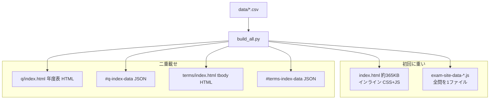

# 読み込み性能 — テンプレ実装方針

exam-site-shell を本番ボリューム（過去問数百問・用語300・ガイド100）まで拡張しても、**初回表示と一覧操作が破綻しない**ための実装方針です。

- 正本のデータ・ビルド: [question-static-pages.md](./question-static-pages.md) · [integration-checklist.md](./integration-checklist.md)
- 変更後は必ず `python3 tools/build_all.py`

---

## 目的と非目的

### 目的

| ページ種別 | 読者が感じる成功 |
|------------|------------------|
| SPA トップ (`index.html`) | ナビと最初の画面がすぐ出る。問題全文は後から |
| 問題一覧 (`q/*/index.html`) | HTML が軽い。検索入力がもたつかない |
| 用語一覧 (`terms/index.html`) | 同上 |
| 個別問題・用語記事 (`q/past/...`, `terms/g-*.html`) | 1問・1語だけ読めばよい（現状は比較的満たしている） |

### 非目的（この文書では扱わない）

- CDN・HTTP/3・Brotli などホスティング側のチューニング（GitHub Pages 等は別途）
- 画像最適化（現テンプレは画像依存が小さい）
- 本番サイト固有の `ORIG_QUESTIONS` 移行手順（[data/README.md](../data/README.md) §取り込み）

---

## 現状の構造とボトルネック



| 症状 | 主因 |
|------|------|
| トップが重い | `index.html` にアプリ全体（約200KB JS + 約88KB CSS）がインライン |
| 問題を増やすと急激に悪化 | `CSV_IMPORTED_QUESTIONS` が1ファイルに全問。一覧も `#q-index-data` に全件 |
| 一覧の検索がカクつく | キー入力のたびに全件フィルタ + DOM 走査（debounce なし） |
| 用語一覧が冗長 | 初期 tbody と JSON が同内容 |

**個別静的問題ページ**（`q/past/y2026/q01/index.html` 等）は 1問分で軽い。遅さの主戦場は **トップ SPA** と **一覧** です。

---

## 設計原則（テンプレで守ること）

1. **CSV が正本** … 手編集 `q/` 禁止は維持。性能対策は **ビルド出力の形** を変える。
2. **SEO と演習の役割分担**
   - **SEO・クロール** … 個別 `q/past/.../index.html`、ガイド、用語詳細、sitemap
   - **一覧のインタラクティブ** … メタデータだけ先に載せ、全文は個別ページへリンク
   - **SPA 演習** … 必要な年度・モードだけ遅延取得
3. **ペイロードは3層に分ける**

| 層 | 内容 | 載せ方 |
|----|------|--------|
| **メタ** | id, 年度, 問番, 分野, href, 抜粋40字, tags | 一覧 JSON（または外部 `.json`） |
| **本文** | 設問全文・選択肢・解説 | 個別静的 HTML **または** SPA 用チャンク |
| **アプリ** | UI・認証・復習・SRS | 1つの deferred JS（将来 `site-app.js`） |

4. **同じデータを HTML と JSON に二重に入れない**（一覧ページ）。

---

## `site-config.json` 拡張（案）

ビルドと HTML 生成が参照するスイッチ。未指定時は後方互換のデフォルト。

```json
{
  "performance": {
    "fonts": "system",
    "indexPayload": "json",
    "indexDataDelivery": "external",
    "spaQuestionBanks": "chunked-by-year",
    "debounceMs": 150
  }
}
```

| キー | 値 | 意味 |
|------|-----|------|
| `fonts` | `system` / `google` | `system` は Google Fonts を出さない（LCP 改善） |
| `indexPayload` | `json` / `hybrid` | `json` = 一覧は JSON のみから描画。`hybrid` = 現行（HTML+JSON） |
| `indexDataDelivery` | `inline` / `external` | `external` = `public/index/past-questions.json` 等を `fetch` |
| `spaQuestionBanks` | `monolith` / `chunked-by-year` | SPA 用バンクを年度ファイルに分割 |
| `debounceMs` | 数値 | 一覧検索の入力待ち（JS 側デフォルトにも反映） |

実装時は `tools/site_config.py` で読み取り、各 `build_*.py` に渡す。

---

## ページ別の読み込み契約（目標）

### SPA トップ `index.html`

**目標:** 初回 HTML **50KB 以下**（圧縮前の目安）、メインスレッド JS **100KB 以下**（分割後）

| 順序 | リソース | 属性 |
|------|----------|------|
| 1 | `site-theme.css` | 同期（小） |
| 2 | `site-shell.js`（新規） | `defer` — ナビ・タブ切替のみ |
| 3 | `site-app.js`（`index.html` から抽出） | `defer` — 演習・復習はルート表示時 |
| 4 | `data/banks/past-manifest.json` | `fetch` — 年度一覧だけ |
| 5 | `data/banks/past-{year}.json` | ユーザーが年度を選んだとき `fetch` |

認証・Supabase・ゲーミフィケーションは **`#dash` 等に初回遷移したとき** 動的 `import()`（Phase 3）。

### 過去問一覧 `q/index.html`

**目標:** HTML **30KB 以下** + 一覧データは **キャッシュ可能な JSON**

```html
<!-- 目標形（indexPayload=json, indexDataDelivery=external） -->
<script type="application/json" id="q-index-config">{"variant":"past",...}</script>
<script defer src="../site-q-index.js"></script>
<!-- q-index-data は無し。site-q-index.js が ../data/index/past-questions.json を fetch -->
```

- **メタのみ**の配列（1問あたりおおよそ 200〜400 バイト × 500問 ≒ 100〜200KB JSON — HTML に埋め込むよりキャッシュ向き）
- 年度ビューは **JS が JSON から初回描画**（`hybrid` 廃止後）
- `noscript` には簡易リンク一覧（SEO フォールバック。全行 tbody は置かない）

### 用語一覧 `terms/index.html`

過去問一覧と同型。

- `#terms-index-data` を external `data/index/glossary-terms.json` に移すか、inline メタのみに縮小
- 初期 tbody は **空** または `noscript` 用の短いリストのみ

### 個別問題 `q/past/.../index.html`

現状維持 + `site-pages.css` を **分割後は `site-pages-article.css` のみ**（Phase 2）。

---

## 実装フェーズ

### Phase 1 — 挙動と二重載せの解消（破壊小・最優先）

| # | 作業 | 触るファイル |
|---|------|----------------|
| 1.1 | 一覧検索に debounce（`performance.debounceMs` または固定 150ms） | `site-q-index.js`, `site-terms-index.js` |
| 1.2 | `exam-site-data-*.js` を `defer` で読み込み（`index.html`） | `index.html`, `tools/apply_site_config.py` |
| 1.3 | `fonts: system` 時は Google Fonts リンクを出さない | `tools/html_footer.py`（`HEAD_FONTS`）, 各 `build_*.py` |
| 1.4 | `indexPayload: json` — 用語一覧の **初期 tbody を空**、JSON のみで描画 | `tools/build_glossary_pages.py`, `site-terms-index.js` |
| 1.5 | `indexPayload: json` — 過去問一覧の **年度 HTML ブロックを生成しない** | `tools/build_past_question_pages.py`, `site-q-index.js`（`ensureYearLayout` + 初回 `buildYearBlocksFromItems()`） |

**検証:** `validate_site_integration.py` を更新 — `#q-index-data` は **inline または external URL** のどちらか必須。件数は CSV と一致。

**デフォルト:** Phase 1 完了後、テンプレの `site-config.json` は `indexPayload: json`, `fonts: system` を推奨。

---

### Phase 2 — 外部 JSON + CSS 分割（キャッシュ効率）

| # | 作業 | 触るファイル |
|---|------|----------------|
| 2.1 | `tools/build_index_data.py`（新規）— `past` / `practice` / `ichimon` / `terms` のメタ JSON を `data/index/*.json` に出力 | 新規 + `build_all.py` に追加 |
| 2.2 | `site-q-index.js` / `site-terms-index.js` — `fetch` + 失敗時メッセージ | 同上 |
| 2.3 | `site-pages.css` → `site-pages-core.css`（レイアウト・ヘッダ）+ `site-pages-q.css`（問題・一覧） | `site-pages.css` 分割、各 builder の link |
| 2.4 | `prepare_public_site.sh` / `template_sync_manifest.txt` に新ファイルを追加 | 同期対象の更新 |

一覧 HTML の転送サイズが **JSON 1リクエスト + 小さい HTML** になり、再訪問時は JSON が disk cache から返る。

---

### Phase 3 — SPA 問題バンクのチャンク化（本番規模向け）

| # | 作業 | 触るファイル |
|---|------|----------------|
| 3.1 | `csv_to_exam_site_past_js.py` — `data/banks/past-{year}.json` と `past-manifest.json` を出力 | ツール |
| 3.2 | `index.html` 内 `applyCsvImportedQuestions` — 全問代入をやめ、年度選択時に `fetch` | SPA ロジック（のち `site-app.js` へ） |
| 3.3 | 実践・一問一答も `practice.json` / `ichimon.json` または分野チャンク | `csv_to_exam_site_ichimondou_js.py` 等 |
| 3.4 | 復習・ミッションは **メタインデックス**（id, field, year）だけ保持し、表示時に詳細 fetch | SPA |

**目安:** トップ初回は manifest + 空の `QUESTIONS`、年度タップで 1ファイル（例: 50〜150KB）だけ追加。

---

### Phase 4 — `index.html` のモジュール化（保守とキャッシュ）

| # | 作業 | 触るファイル |
|---|------|----------------|
| 4.1 | インライン CSS → `site-spa.css`（ビルド時に抽出でも可） | `index.html`, 新規 CSS |
| 4.2 | インライン JS → `site-app.js`（`defer`） | `index.html` |
| 4.3 | オプション: 認証・SRS を `site-app-auth.js` 等に `import()` | SPA |

`index.html` はシェル + script タグのみにし、**バージョンクエリ**（`?v=build_id`）でキャッシュ bust。

---

## ビルドパイプラインへの組み込み

```text
validate_csv.py
apply_site_config.py
csv_to_exam_site_past_js.py      # Phase 3 でチャンク出力に拡張
csv_to_exam_site_ichimondou_js.py
build_index_data.py              # Phase 2 で追加（一覧メタ JSON）
build_past_question_pages.py     # Phase 1.5 で HTML 軽量化
build_practice_ichimon_pages.py
build_article_pages.py
build_glossary_pages.py
validate_site_integration.py     # external JSON 契約を追加
...
```

`build_index_data.py` の責務:

- 入力: 既存 CSV（`load_rows` 等を再利用）
- 出力例:
  - `data/index/past-questions.json` — `index_item_dict` と同型の配列
  - `data/index/glossary-terms.json` — `terms_index_item_dict` と同型
- `public_site/` コピー時に `data/index/` もルート相対で配信可能にする（`prepare_public_site.sh`）

---

## サイズ予算（本番想定の目安）

| 資産 | 現状（サンプル） | 目標（500過去問・300用語） |
|------|------------------|---------------------------|
| `index.html` | ~365KB | **< 80KB**（Phase 4 後） |
| 一覧 HTML | ~15KB + 埋め込み JSON | **< 25KB** HTML + JSON **別ファイル ~150KB** |
| 一覧初回 JS 実行 | 全件 DOM | メタ JSON parse 1回 + debounce 付き描画 |
| SPA 初回データ | 全問 in JS | manifest **< 5KB** + 未選択時 0 |

---

## SEO への影響

| 懸念 | 対策 |
|------|------|
| 一覧が JS 依存になる | 個別 `q/past/...`・`sitemap.xml` は従来どおり。一覧は補助的インデックス |
| クローラが一覧を見ない | `noscript` に主要リンクの簡易リスト（ビルド生成） |
| 構造化データ | 個別問題ページの JSON-LD は維持 |

---

## 後方互換と本番同期

- `performance` 未設定 → 現行どおり `hybrid` + `monolith`（既存本番を壊さない）
- `sync_from_template.py` は **エンジンと `site-*.js` のみ** — 本番 `data/` は触らない
- 本番で Phase 3 を有効にするには、本番側でも `build_all` 後に `data/banks/` が生成されていること

---

## 作業の進め方（推奨）

1. **Phase 1.1〜1.3** だけマージ → 体感のカクつきとフォント待ちを改善（データ構造は不変）
2. **Phase 1.4〜1.5** + 検証更新 → 一覧 HTML の二重載せを解消
3. 本番1サイトで `build_all` + Lighthouse（Mobile）を計測
4. **Phase 2〜3** は問題数が 200問を超えたサイトから順に有効化

---

## 関連ファイル早見表

| 役割 | ファイル |
|------|----------|
| 一覧 UI | `site-q-index.js`, `site-terms-index.js` |
| 過去問一覧生成 | `tools/build_past_question_pages.py` |
| 用語一覧生成 | `tools/build_glossary_pages.py` |
| SPA データ生成 | `tools/csv_to_exam_site_past_js.py`, `tools/csv_to_exam_site_ichimondou_js.py` |
| 統合検証 | `tools/validate_site_integration.py` |
| 設定 | `site-config.json`, `tools/site_config.py` |
