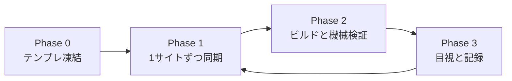

# SEO 記事デザイン — 全サイト反映チェックリスト

**目的:** デザイン・内部リンク・FAQ 形式を **11 資格サイト**へ、同期漏れ・ビルド漏れ・目視漏れなく反映する。  
**仕様正本:** [seo-editorial-rollout-template.md](./seo-editorial-rollout-template.md)  
**運用正本:** [multi-site-workflow.md](./multi-site-workflow.md) / [integration-checklist.md](./integration-checklist.md)

---

## 0. 全体像（3 フェーズ）



| フェーズ | やること | 合格条件 |
|----------|----------|----------|
| **0** | テンプレで正本を確定・マニフェスト更新 | テンプレ `verify` + `build_all` OK |
| **1** | drift 確認 → dry-run → sync | 必須ファイルが target に存在 |
| **2** | `build_all`（またはサイト別代替）+ 検証 | 下記「機械ゲート」すべて |
| **3** | 目視 5 点 + 台帳更新 | チェック表に ✅ |

**原則:** 1 サイト完了 → 記録 → 次サイト。**一括 sync だけして build を後回しにしない。**

---

## 1. Phase 0 — テンプレ正本（1 回だけ）

### 1.1 凍結確認

テンプレ root（`exam-site-shell`）で:

```bash
cd /path/to/exam-site-shell

# エンジンファイルが揃っているか（マニフェスト + SEO 追加ファイル）
python3 tools/verify_seo_editorial_rollout.py --target .

# テンプレ全体ビルド（編集品質監査込み）
python3 tools/build_all.py
```

| 確認項目 | 方法 |
|----------|------|
| CSS バージョン | `tools/seo_editorial_chrome.py` の `SEO_EDITORIAL_CSS_VER`（現行: `20260530-editorial-link-cards`） |
| マニフェスト | `tools/template_sync_manifest.txt` に `seo-editorial.css` / `internal_links.py` 等が含まれる |
| プレビュー | `terms/samples/seo-editorial-preview.html` をブラウザで確認 |

### 1.2 テンプレで直すのはここだけ

以降のサイト反映では **本番の CSV・site-config は触らない**。UI・generator の変更はテンプレ → sync のループ。

---

## 2. サイト台帳（反映順）

ローカルパスは環境により異なる。**sync 前に `--target` が実在するか必ず確認。**

| # | サイト ID | 同期方式 | ローカル例 | 特記 |
|---|-----------|----------|------------|------|
| 1 | `boiler-master` | フル | `~/Projects/boiler-master.jp` | — |
| 2 | `chintaikanrishi-master` | フル | `~/Projects/chintaikanrishi-master` | — |
| 3 | `eisei1shu-master` | フル | `~/Projects/eisei1shu-master` | — |
| 4 | `eisei2shu-master` | フル | `~/Projects/eisei2shu-master` | — |
| 5 | `kangyou-master` | フル | `~/Projects/kangyou-master` | gh-pages 配信 |
| 6 | `kikenbutsu-master` | フル | `~/Projects/kikenbutsu-master` | gh-pages 配信 |
| 7 | `mentalhealth-master` | フル | `~/Projects/mentalhealth-master` | — |
| 8 | `mankan-master` | フル + **site-only** | `~/Projects/mankan-master` | [SITE.md](../sites/mankan-master/SITE.md) |
| 9 | `unkan-master` | フル + **site-only** | `~/Projects/unkan-master` | [SITE.md](../sites/unkan-master/SITE.md) |
| 10 | `takken-master` | フル | `~/Projects/takken-master` | [SITE.md](../sites/takken-master/SITE.md) |
| 11 | （予備） | — | 新規は `_example` 参照 | — |

**反映順の推奨:** 記事数が少ないサイト（boiler 等）→ 標準サイト → mankan/unkan → **最後に takken**（規模が大きいため）。

---

## 3. Phase 1 — 1 サイトあたりの同期

テンプレ root で実行（`<TARGET>` を差し替え）:

```bash
cd /path/to/exam-site-shell

# A. 事前: 本番 working tree が clean か
cd <TARGET> && git status && git pull --ff-only && cd -

# B. 差分一覧（missing / different をメモ）
python3 tools/check_template_drift.py --target <TARGET> --fail-on-drift

# C. dry-run（コピー予定ファイルを確認）
python3 tools/sync_from_template.py --target <TARGET> --dry-run

# D. 本番 sync
python3 tools/sync_from_template.py --target <TARGET>
```

### 3.1 site-only 付き（mankan / unkan）

```bash
python3 tools/sync_from_template.py \
  --target <TARGET> \
  --site-only sites/<site-id>/site-only.paths
```

`site-only.paths` に載っているファイルは **上書きされない**。sync 後に drift で「テンプレより古いまま」のファイルがないか確認。

### 3.2 宅建（takken-master）— フル sync 禁止

[SITE.md](../sites/takken-master/SITE.md) の **フェーズ 1 → 2 → 3** を順守。  
各フェーズ末尾で必ず `build_all` + 検証。**SEO 反映はフェーズ 1 のマニフェストに SEO ファイルを含める。**

### 3.3 sync 直後のエンジン確認

```bash
python3 tools/verify_seo_editorial_rollout.py --target <TARGET>
```

| チェック | 内容 |
|----------|------|
| 必須ファイル | `seo-editorial.css`, `tools/internal_links.py` 等 12 ファイル |
| CSS バージョン | テンプレと target の `SEO_EDITORIAL_CSS_VER` が一致 |
| 生成 HTML サンプル | ガイド・用語・比較各 1 ページにデザインマーカー（未ビルドなら WARN） |

---

## 4. Phase 2 — ビルドと機械検証

### 4.1 標準（フル同期サイト）

```bash
cd <TARGET>
python3 tools/build_all.py
```

`build_all.py` の順序（抜粋）:

1. `validate_csv.py`
2. **`audit_editorial_quality.py`** ← 量産テンプレ残存で **ERROR 多数のとき失敗**
3. 各 `build_*.py`（SEO 記事含む）
4. `validate_site_integration.py`
5. `validate_internal_links.py` ほか

### 4.2 編集品質で build_all が止まる場合

**デザイン反映と本文リライトは別フェーズ**として扱う。

| 状況 | 対応 |
|------|------|
| ERROR = 量産テンプレ禁止句のみ | 下記「SEO 最小ビルド」を実行し、デザイン反映を先に完了。本文リライトは別タスク |
| ERROR = CSV 構造・リンク切れ | **先に修正**。デザイン sync だけ進めない |
| WARN のみ | そのまま `build_all` 継続可 |

**SEO 最小ビルド**（編集品質を除く SEO ページ再生成）:

```bash
cd <TARGET>
python3 tools/apply_site_config.py
python3 tools/build_article_pages.py
python3 tools/build_glossary_pages.py
python3 tools/build_compare_pages.py
python3 tools/build_numbers_mistakes_pages.py
python3 tools/build_seo_editorial_preview.py
python3 tools/validate_generated_seo.py
python3 tools/validate_internal_links.py
python3 tools/validate_site_integration.py
python3 tools/validate_public_content.py
```

→ 台帳に「編集品質 ERROR 残・本文リライト待ち」と明記。

### 4.3 機械ゲート（すべて PASS が理想）

| # | コマンド | 必須 | 備考 |
|---|----------|------|------|
| G1 | `verify_seo_editorial_rollout.py --target .` | ✅ | CSS ver + マーカー |
| G2 | `validate_generated_seo.py` | ✅ | 要点・FAQ・信頼性ブロック順序 |
| G3 | `validate_internal_links.py` | ✅ | 内部 href 整合 |
| G4 | `validate_site_integration.py` | ✅ | フッター・タブ・用語一覧 |
| G5 | `validate_public_content.py` | ✅ | 運用者向け文言漏れ |
| G6 | `audit_editorial_quality.py` | 理想 | 本文オリジナル化完了後 |

### 4.4 gh-pages 配信サイト（kangyou / kikenbutsu 等）

`main` で build 成功後:

```bash
bash tools/sync_gh_pages_branch.sh
# または build_all 末尾の gh-pages 同期手順（各 SITE.md 参照）
```

**main だけ更新して gh-pages を忘れると本番だけ古い CSS のまま** — 台帳に gh-pages push 済みか記録。

---

## 5. Phase 3 — 目視チェック（1 サイト 5 分）

ブラウザでローカル `file://` または `python3 -m http.server` 推奨。**キャッシュ無効**または `?v=` 確認。

| # | ページ | URL 例 | 確認 |
|---|--------|--------|------|
| V1 | SEO プレビュー | `terms/samples/seo-editorial-preview.html` | 全要素の見本 |
| V2 | 試験ガイド 1 本 | `articles/<slug>/index.html` | H1 24px / 要点 19px / FAQ details 展開 |
| V3 | 用語 1 本 | `terms/g-*.html` | 関連リンク **カード型 + →** / 過去問セクション |
| V4 | 比較 1 本 | `terms/compare/c-*.html` | 目次クリック → 着地余白 |
| V5 | モバイル 375px | V2 または V3 | 横スクロールなし・カード折返し |

### デザイン合格基準（抜粋）

- 要点ボックス = 信頼性パネルと同系グレー（薄青なし）
- FAQ = `<details class="term-faq-item" open>`（表形式なし）
- 関連リンク = 白カード + 左 3px アクセント + 右矢印
- 本文インラインリンク = 青太字 + 下線
- `seo-editorial.css?v=20260530-editorial-link-cards`（現行 ver）

---

## 6. 記録テンプレ（サイトごとにコピー）

```markdown
### <site-id> — YYYY-MM-DD

- [ ] git pull / clean
- [ ] drift --fail-on-drift
- [ ] sync（dry-run → 本番）
- [ ] verify_seo_editorial_rollout OK
- [ ] build_all OK（または SEO 最小ビルド + 理由）
- [ ] G1–G5 PASS
- [ ] 目視 V1–V5
- [ ] gh-pages（該当サイトのみ）
- commit: （hash / 未実施）
- 備考:
```

---

## 7. ロールバック

```bash
cd <TARGET>
git checkout HEAD -- seo-editorial.css tools/ tools/build_*.py  # 必要な範囲
git restore articles/ terms/   # 生成物を直前 commit に戻す場合
python3 tools/build_all.py
```

sync 前に **必ず commit または stash** しておく。問題があれば sync 前の commit に `git reset --hard`（運用者判断）。

---

## 8. よくあるミス

| 症状 | 原因 | 対処 |
|------|------|------|
| CSS だけ古い | `seo-editorial.css` 未 sync またはキャッシュ | drift + `?v=` 確認 |
| FAQ が表形式 | 旧 HTML のまま | `build_*` 未実行 / 旧 `knowledge_hub_seo.py` |
| 関連リンクが下線テキスト | 旧 CSS または `site-pages.css` 競合 | `seo-editorial.css` 同期・詳細度確認 |
| 目次着地がヘッダーに隠れる | `--seo-scroll-anchor-gutter` 未反映 | CSS sync + 再ビルド |
| build_all 即 fail | 編集品質 ERROR | §4.2 SEO 最小ビルド or 本文修正 |
| 本番だけ古い | gh-pages 未更新 | `sync_gh_pages_branch.sh` |
| takken で q/ 崩壊 | フル sync した | SITE.md フェーズ手順に戻す |

---

## 9. 関連コマンド早見

```bash
# テンプレ → 1 サイト（標準）
python3 tools/check_template_drift.py --target <TARGET> --fail-on-drift
python3 tools/sync_from_template.py --target <TARGET> --dry-run
python3 tools/sync_from_template.py --target <TARGET> --build

# 反映確認
python3 tools/verify_seo_editorial_rollout.py --target <TARGET>
```

**commit / push / 本番デプロイは運用者の明示指示時のみ。**
